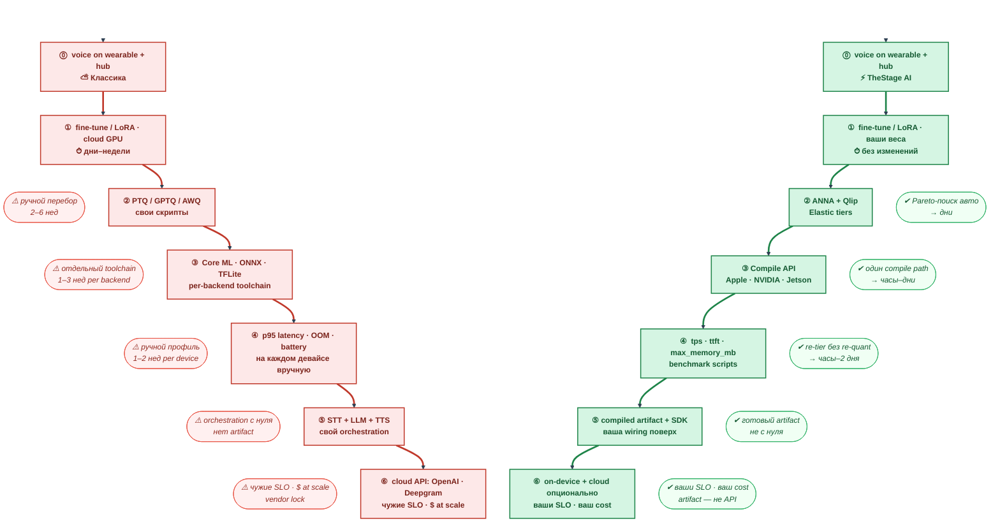
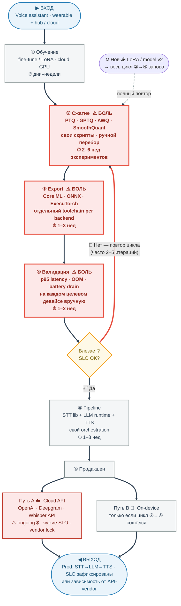
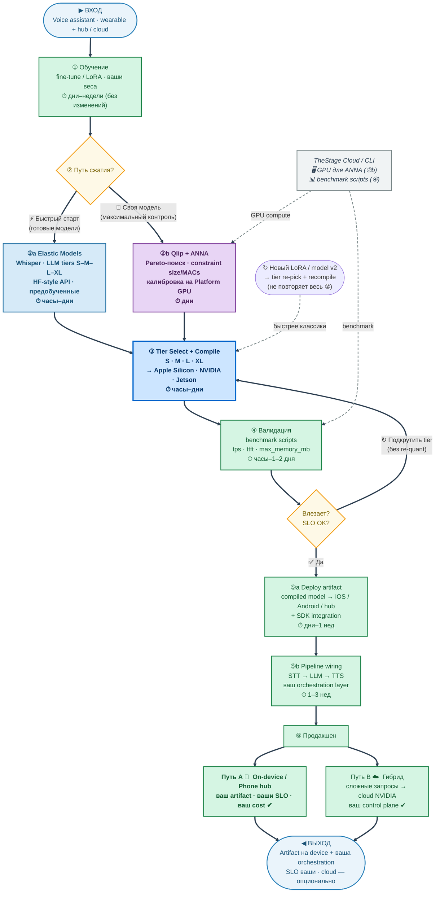
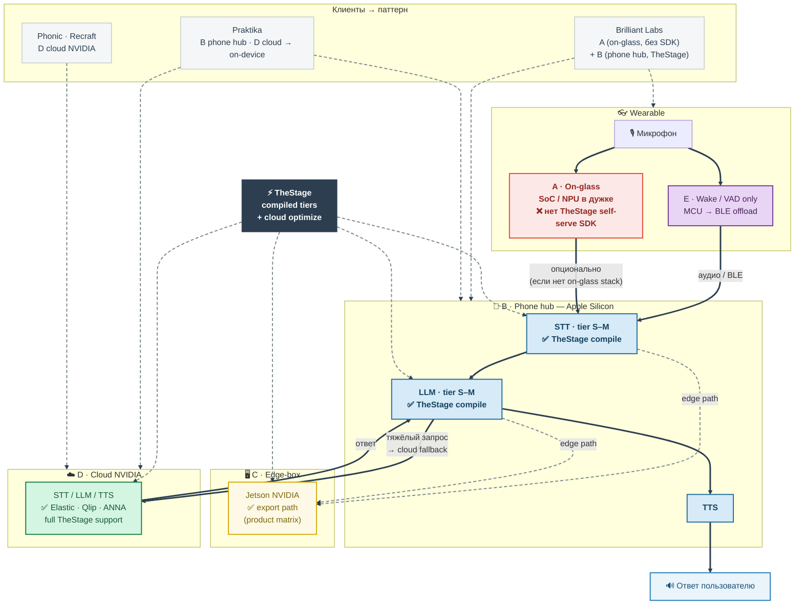

# ML workflow: классика vs TheStage AI (wearable / voice)

**Аудитория:** ML-команда (wearable, on-device voice)  
**Формат:** Mermaid — рендерится в GitHub, Cursor, Notion, [mermaid.live](https://mermaid.live)

**Как читать:** §1 — два столбца **рядом** (одна строка = один этап); §2–3 — полный путь сверху вниз; §4 — паттерны runtime + **только** клиенты из наших notes; §5–6 — таблица и легенда.

---

## 1. Два процесса рядом (overview) — side by side

Слева — классика, справа — TheStage. Вертикальные стрелки **внутри каждого столбца**; горизонтально на одной строке — **один и тот же № этапа**.

| № | Общее название | Классика | TheStage AI | Бенефит TheStage | Ориентир срока |
|---|----------------|----------|-------------|------------------|----------------|
| **0** | Цель | voice on wearable + hub | то же | — | — |
| **1** | Обучение | fine-tune / LoRA | то же | train без изменений | **дни–недели** |
| **2** | Сжатие | PTQ/GPTQ/AWQ вручную | ANNA+Qlip / Elastic | меньше перебора | **2–6 нед** → **дни** |
| **3** | Export / compile | Core ML / ONNX / TFLite | Apple / NVIDIA / Jetson | один compile path | **1–3 нед** → **часы–дни** |
| **4** | Валидация | профиль на девайсах | benchmark tiers | re-tier без полного re-quant | **1–2 нед** → **часы–2 дня** |
| **5** | Pipeline | STT→LLM→TTS своё | SDK + ваша wiring | готовый artifact | **1–3 нед** |
| **6** | Прод | часто cloud API | on-device + cloud opt. | ваши SLO | runtime |

*Сроки — ориентиры для pitch; PoC у клиента может отличаться.*

---

## 2. Классический процесс (детально)

**Вход:** нужен voice assistant (wearable + phone hub / cloud).  
**Выход:** прод с известными SLO — либо cloud API, либо частично on-device, если цикл **②→③→④** сошёлся.  
**Петля:** новый LoRA / v2 → снова **② Сжатие**.

**Боли:** цикл **②→③→④** повторяется; cloud API = чужие SLO и cost at scale.

---

## 3. Процесс с TheStage AI (детально)

**Вход:** та же цель — voice assistant.  
**Выход:** прод с **compiled artifact** на вашем железе (tiers), опционально гибрид с cloud; SLO ваши.  
**Петля:** новый LoRA → только **③ tier re-pick + recompile** (не весь ②).  
**Параллельно:** Platform/CLI — GPU для **②b** (ANNA) и **④** (benchmark).

**Сдвиг:** меньше ручного export; измеримые tiers; GPU-калибровка через Platform; прод — ваш artifact, не только API.

---

## 4. Архитектура runtime (wearable) — где крутятся модели

**Важно:** wearable ≠ всегда «только слабое железо». Ниже — **паттерны из product matrix** (docs/сайт) и **как ими пользуются известные клиенты** (~6 paying + якорные notes). Без вымышленных OEM.

| Паттерн | Где inference | Железо | TheStage сегодня | Кто так делает (наши данные) |
|---------|---------------|--------|------------------|------------------------------|
| **A. On-glass** | STT/LLM в дужке | Snapdragon / Android SoC, NPU on-glass (OEM) | ❌ нет self-serve QNN/SDK | **Brilliant Labs** — on-glass NPU (Alif) + **не** документированный compile TheStage на Qualcomm; типовой industry gap |
| **B. Phone hub** | STT/LLM на paired phone | Apple Silicon (compile path) | ✅ tiers S–M, Apple compile | **Brilliant Labs** — TheStage на **paired smartphone** (press); **Praktika** — приложение на телефоне, migration on-device |
| **C. Edge-box** | Hub в кейсе / на линии | Jetson (NVIDIA) | ✅ export path в маркетинге | Product matrix; **именованного paying только-Jetson** в notes нет |
| **D. Cloud-first** | Очки/апп = capture; AI в облаке | NVIDIA GPU | ✅ Elastic + Qlip + ANNA | **Praktika** (сейчас cloud → device); **Phonic**; **Recraft**; **Nebius** — infra/канал, не wearable app |
| **E. Split wake** | Wake/VAD на device, тяжёлое — hub/cloud | MCU + BLE | ⚠️ wake — vendor; STT/LLM — TheStage на B или D | Типовый mass-market glasses; **Brilliant**-class hybrid |

**Публичные кейсы (не все wearable):** SaladCloud, Wallarm — cloud optimize; Huawei P50/P60 — **кастомный** on-device Snapdragon (R&D), не self-serve SDK для glasses.

**На звонке:** спросить prospect — **A / B / C / D** в roadmap. On-glass Qualcomm **вне** стандартного продукта; для wearables с AI сегодня чаще **B + D** (Brilliant, Praktika).

---

## 5. Что меняется одной таблицей

| № этап | Классика | С TheStage AI | Бенефит + срок |
|--------|----------|---------------|----------------|
| ② Сжатие | Свои PTQ/GPTQ эксперименты | ANNA + tiers или Elastic | **2–6 нед → дни** |
| ③ Export | Ручной Core ML / ONNX | Compile API | **1–3 нед → часы–дни** |
| ④ Валидация | Свои бенчмарки на девайсах | tps, ttft, max_memory_mb | Быстрее re-tier **часы–2 дня** |
| GPU для экспериментов | Свой k8s / ноутбук | Platform CLI, Nebius/AWS | Не строить кластер |
| Обновление LoRA | Часто весь цикл заново | Tier re-pick + recompile | Меньше повтор **②③** |
| ⑥ Прод SLO | Зависит от API vendor | Ваш artifact на железе | Cost + latency под контролем |
| ⑤ Orchestration | 100% ваша | В основном ваша | Vision: orchestrator позже |

---

## 6. Легенда

| Термин | Значение |
|--------|----------|
| PTQ/GPTQ/AWQ | Способы сжать уже обученную модель |
| Tier S/M/L/XL | Степень сжатия (быстрее ↔ качественнее) |
| tps / ttft | Скорость генерации / задержка до первого токена |
| OOM | Не хватило памяти на устройстве |
| Phone hub | Paired smartphone — compute (Brilliant, Praktika) |
| On-glass | Inference на SoC в очках — обычно **без** TheStage self-serve SDK |
| Edge-box | Jetson / промышленный hub (product matrix) |
| Cloud-first | Capture на device; модели на NVIDIA (Praktika, Phonic, Recraft) |

**Источник по клиентам:** [Stage AI — understanding brief](Stage%20AI%20%E2%80%94%20understanding%20brief.md) §3.8–3.9, реестр §2–3.
