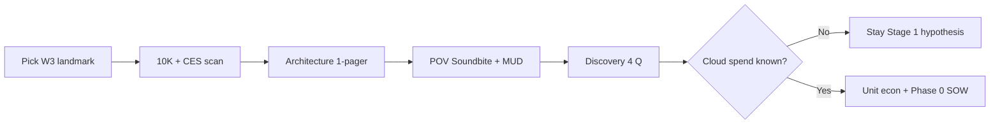

# GTM — finance-first motion (strategy & prep)

---

## 0. Что такое finance-first motion (одним абзацем)

**Technical-first:** первый разговор с VP Engineering — tiers, latency, export.  
**Finance-first:** первый разговор с **CFO / CEO / VP BD** — «сколько стоит AI в P&L: $/1k sessions, $/device/year, pilot cloud burn».

TheStage в этом motion = **Layer A (Optimize):** дешевле и предсказуемее **облачный** inference на NVIDIA, плюс **одностраничник для OEM** (задержка + $/1000 сессий). **Не** обещаем замену чипа в дужке очков в Phase 1.

---

## 1. Landmark-клиенты (кого готовим под этот motion)

### 1.1 Wearable landmark **W3** (основной пул)

Паттерн: **умные очки / industrial wearable**, AI частично **на чипе в устройстве**, но **ценность TheStage — облако + OEM-пилоты**.

| Приоритет | Компания | Тикер / тип | Почему landmark | Первый угол |
|-----------|----------|-------------|-----------------|-------------|
| **Anchor** | **Vuzix** | NASDAQ VUZI | Публичный microcap, OEM + CES AI story, illustration готов | Cloud COGS · $/1k sessions |
| **P1** | **RealWear** | Private | Industrial voice, S7 on-glass → cloud NVIDIA | То же, без IR |
| **P1** | **DigiLens (ARGO)** | Private | AR + voice, enterprise | Cloud + OEM |
| **P2** | **ThirdEye** | Private | Enterprise AR glasses | Cloud pilots |
| **P2** | **Envision** | Private | Accessibility AI on glasses | Cloud path verify |
| **Research** | Kopin ecosystem OEMs | KOPN (indirect) | Displays; inference у **их** клиентов | Edge / partner stack |

**Не landmarks для этого motion:** Meta, Apple, Google XR, Samsung — свой стек, не outbound.  
**Не W3 (другой playbook):** Halliday, Even Realities, Mentra — это **W2 / S4** (iPhone companion), finance-first **не lead**.

### 1.2 Публичные / distressed (расширение W3 + adjacent)

| Компания | Тикер | S / W | Finance-first angle | Оговорка |
|----------|-------|-------|---------------------|----------|
| **Vuzix** | VUZI | S7, W3 | OEM + cloud COGS | **Primary template** |
| **Kopin** | KOPN | S5 | Edge / display customers’ inference | Indirect, не очки напрямую |
| **Cerence** | CRNC | S1, W4 | Automotive voice at OEM scale | B2B voice, не glasses |
| **Chegg / Busuu** | CHGG | S2→S3, W1 | MAU × cloud → device | **Другая** история (app, не OEM) |

### 1.3 Что подготовить по каждому landmark (минимум)

| Артефакт | Содержание |
|----------|------------|
| **Architecture 1-pager** | Где AI: on-glass vs cloud vs partner — честно «$0 / primary» |
| **10-K / IR scan** | Revenue, loss, going concern, AI в shareholder letter |
| **POV draft** | Soundbite + MUD (hypothesis) |
| **Discovery script** | 4 вопроса §11.4 finance-first POV) |
| **Account illustration** | Для VUZI — full doc); для остальных — копировать структуру после discovery |

**CRM:** `landmark: W3` · `buyer_motion: hybrid` · `segment: S7`.

---

## 2. Метрики, на которые влияем больше всего

Ранжирование для **нарратива** (что говорить CEO/CFO первым). Технические метрики — **после** sponsor, в отчёте для ML.

### 2.1 Tier 1 — говорим вслух на exec (доллары и unit economics)

| # | Метрика | Простыми словами | Сила влияния TheStage | Когда не использовать |
|---|---------|------------------|----------------------|------------------------|
| 1 | **$/1k sessions** | Цена **1000** пользовательских AI-циклов | **Высокая** — OEM и CFO понимают | Нет cloud AI у клиента |
| 2 | **$/device/year** | Экономия **на одно устройство в год** | **Высокая** — одна цифра на слайде | Нельзя посчитать N in-scope |
| 3 | **$/inference** (или % снижение) | Цена **одного** запуска модели | **Высокая** — доказуемо в PoC | Только API без своего GPU |
| 4 | **OEM pilot cloud burn** | Сколько **съедает облако** на пилот до сделки | **Средняя–высокая** | Нет OEM pipeline |
| 5 | **Cost of inaction (3 yr)** | «Сколько потеряем, если ничего не делать» | **Средняя** (story) | Без baseline spend |

### 2.2 Tier 2 — стратегия CEO / BD (не всегда в $)

| Метрика | Простыми словами | Роль |
|---------|------------------|------|
| **OEM design-win rate** | Выиграли ли **лицензию дизайна** | TheStage даёт **измеримую unit economics** ($/1k sessions) |
| **Time-to-SKU (AI block)** | Как быстро **вышла новая модель** с AI | Меньше месяцев ML на quant |
| **Partnership diligence** | Партнёр (Quanta-class) **проверяет AI** | PoC benchmark + $/device/year |
| **Variable COGS trend** | Cloud inference в P&L | Не demo, а $/1k sessions на earnings |

### 2.3 Tier 3 — enabling (ML-only в первом касании)

| Метрика | Кому | Не lead с CFO потому что |
|---------|------|--------------------------|
| **p95 latency** | OEM UX + ML | Нужна, но CFO хочет $ |
| **ttft / tps** | ML | Жаргон |
| **Tier S/M/L/XL** | ML deploy | Про железо, не P&L |
| **max_memory_mb** | Companion path | Редко на W3 |

### 2.4 Anti-metrics (не обещать в finance-first)

- Срез **OpEx / payroll** ($8M programs)  
- **Gross margin %** без allocation AI в COGS  
- **Замена Snapdragon / on-glass SDK** *(пока — Qualcomm поддержка разработана, но не в публичном релизе; не обещать до анонса)*  
- **$500k/год** без определения N (см. Vuzix §4.3.md#43-layer-2--scenario-table-n--deviceyear))  
- **2–4×** без PoC на **их** модели  

---

## 3. Сигналы таргетинга и как их использовать

### 3.1 Firmographic / account fit

| Сигнал | Где смотреть | Порог «в motion» | Действие |
|--------|--------------|------------------|----------|
| **Публичная компания US** | NASDAQ/NYSE | Micro/small cap OK | IR + 10-K prep |
| **Wearables / smart glasses / industrial HMD** | Site, CES, LinkedIn | Product line с voice/vision AI | Tag W3 |
| **OEM / licensing в стратегии** | 10-K, earnings | «Reference design», «partner», «license» | BD + CEO angle |
| **~50–500 FTE** (не mega-cap) | LinkedIn, filings | Reachable founder/exec | Outbound feasible |

### 3.2 Technographic (архитектура — обязательно)

| Сигнал | Как проверить | Хорошо для motion | Плохо / deprioritize |
|--------|---------------|-------------------|----------------------|
| **Partner cloud AI** (Ramblr-class PR) | Press, partner pages | ✅ Primary savings | — |
| **NVIDIA / GPU cloud** в job posts | LinkedIn, careers | ✅ Layer A fit | Only on-device, no cloud |
| **Snapdragon on-glass AI** | CES, spec sheets | ✅ **Сильная история** — Qualcomm поддержка в разработке | Не продавать on-device compile до публичного релиза; питч: «cloud сейчас + on-device unlock скоро» |
| **100% on-device, no cloud** | Architecture interview | ⚠️ R&D / early — Qualcomm в разработке | Не обещать; «скоро сможем» — только если ТМ разрешает |
| **iPhone companion app** | SKU docs | Phase 2 (S4) | Don't mix in CFO mail |

**Правило 60 сек:** если **нет** облачного AI сейчас и **нет** в roadmap на 12 мес → **не** finance-first lead.

### 3.3 Financial / IR signals

| Сигнал | Где | Как использовать в outreach |
|--------|-----|---------------------------|
| **Going concern / substantial doubt** | 10-K risk factors | «Variable COGS control» не «спасём компанию» |
| **Net loss >> revenue** | Income statement | CFO cares about **unit economics** |
| **AI in CES / shareholder letter** без $ | IR, press | Gap: «metric missing for OEM diligence» |
| **OpEx reduction program** | 10-K, earnings | Acknowledge pressure; **don't** claim we cut OpEx |
| **Partnership announced** (Quanta, Garmin-class) | PR | «What AI spec did partner receive?» |

### 3.4 Intent / timing signals

| Сигнал | Источник | Действие |
|--------|----------|----------|
| New **OEM program** or SKU | Press, jobs | PoC «one cloud model» |
| **Hiring ML / cloud inference** | LinkedIn | Technical thread |
| **Earnings in 4–8 weeks** | Calendar | CEO soundbite before call |
| **RFP / pilot** language in BD posts | Jobs | VP BD hook — $/1k sessions в business case |
| Competitor **AI glasses** launch | News | Crowd step in MDP |

### 3.5 Clay / Apollo / SN — поля для списка

| Поле | Значение |
|------|----------|
| `icp_segment` | S7 |
| `wearable_landmark` | W3 |
| `buyer_motion` | hybrid |
| `public_ticker` | e.g. VUZI |
| `cloud_ai_signal` | Y/N/unknown |
| `oem_model` | Y/N |
| `going_concern_flag` | Y/N |
| `finance_first_track` | Y |

**Pilot list (Roadmap w3):** 50–100 accounts → **отдельный тег** `finance_first_track=Y`, не смешивать с W1 Praktika messaging.

---

## 4. Financial literacy — что прояснить, чтобы цифры работали

Без этих ответов **$/device** и ROI — гипотеза, не business case.

### 4.1 Про продукт TheStage (честность в сделке)

| Вопрос | Зачем | Ответ для motion |
|--------|-------|------------------|
| Что продаём в Phase 0–1? | Scope PoC | **Layer A only:** benchmark + optimize **1–2 cloud models** on **NVIDIA** |
| Что **не** продаём? | Avoid disappointment | On-glass Snapdragon compile (**пока** — в разработке, не в релизе; не обещать до анонса); full orchestration STT→LLM→TTS on glasses; OpEx cut |
| Что доказываем в PoC? | PoI | **$/session**, **p95**, **optimization %** — not margin % |
| Что после PoC? | Phase 1 | Production optimize + optional OEM PDF |
| Кто внутри TheStage на сделке? | Delivery | ML + один **finance memo** writer |

### 4.2 Про сетап клиента (architecture discovery)

| # | Вопрос клиенту | Простыми словами | Влияет на |
|---|----------------|------------------|-----------|
| 1 | Где **сейчас** крутится самый дорогой AI? | Облако, очки, телефон, партнёр? | Primary $ layer |
| 2 | **Кто платит** GPU в OEM pilot — вы, OEM, end customer? | Кто несёт burn пилота | L3 pilots |
| 3 | **Monthly cloud/GPU** на AI — порядок $? | Реальный baseline | $/session |
| 4 | Сколько **устройств** с **активным cloud AI** (не всего shipped)? | N in-scope | $/device × N |
| 5 | Сколько **сессий/устройство/год** (или DAU × turns)? | Volume | $/device formula |
| 6 | Какая **одна модель** для PoC (Whisper, vision encoder, partner stack)? | Scope | PoC SOW |
| 7 | Есть **RFP/SLO** требования от OEM? | Что в контракт | p95 + $/1k |
| 8 | План **новых SKU** с AI в 12 мес? | Growth N | Scenario table |

**4 discovery questions (краткий набор):** см. finance-first POV §11.4).

### 4.3 Про финансовую модель клиента (CFO literacy)

| Понятие | Ошибка | Правильно |
|---------|--------|-----------|
| **COGS vs OpEx** | «Сэкономим $8M программы сокращений» | Экономим **переменную** облачную часть на устройство/сессию |
| **Variable vs fixed** | Обещать headcount | FTE только **soft** (R&D efficiency) |
| **Revenue scale** | $500k savings у $6M revenue без контекста | Показать **% of cloud spend** и **N** |
| **In-scope device** | 100k shipped × $5 | Только устройства **с cloud AI** |
| **Pilot vs production** | Суммировать пилот + fleet без overlap | Adjust double-count |
| **Public claims** | Цифры в IR без PoC | **Illustration** / PoC-validated only |

### 4.4 Про наш pricing (internal — перед SOW)

| Прояснить внутри | Illustration (VUZI) |
|------------------|---------------------|
| Phase 0 fee band | $35–45k, 6 weeks, 1 model |
| Year 1 platform | $70–90k |
| Success criteria in SOW | $/session ↓ X%, p95 ≤ Y ms |
| Who signs — Eng vs CFO | Eng scope; CFO **economic** buy-in on variable $ |

### 4.5 Чеклист «можно ли строить business case»

- [ ] Подтверждён **cloud path** с measurable spend  
- [ ] Есть **owner** (VP Eng + champion BD/CEO)  
- [ ] Согласован **1 model** для PoC  
- [ ] CFO понимает: **$5/device — hypothesis** до benchmark  
- [ ] Architecture slide: **$0 on-glass** сказано вслух  
- [ ] Нет обещания **OpEx / payroll**  

---

## 5. Что подготовить для motion (операционный backlog)

### 5.1 Стратегия и контент (недели 2–4 Roadmap)

| # | Deliverable | Статус / ссылка |
|---|-------------|-----------------|
| 1 | Finance-first **playbook** | ✅ POV finance-first) |
| 2 | POV **framework** (3 stages, MUD) | ✅ how to build) |
| 3 | **Account illustration** VUZI | ✅ Vuzix doc) |
| 4 | **This doc** — landmarks, metrics, signals, literacy | ✅ |
| 5 | Messaging matrix **finance row** | 🔲 Roadmap w2 |
| 6 | **Research checklist** per account (10-K, arch map) | 🔲 POV §6) |
| 7 | Pilot list 50–100 с тегом `finance_first` | 🔲 Roadmap w3 |
| 8 | Slide «P&L AI vs demo AI» | 🔲 Roadmap w4 |
| 9 | Dual PoC template: **finance memo** + **tech report** | 🔲 Roadmap w4 |
| 10 | CRM fields: `buyer_motion`, `landmark`, `cloud_ai_signal` | 🔲 |

### 5.2 Per-account prep (повторяемый процесс)

### 5.3 Роли в сделке

| Роль | Deliverable от TheStage |
|------|-------------------------|
| **Founder / AE** | Exec intro, soundbite, sponsor hunt |
| **Solutions / ML** | PoC scope, tech report |
| **Finance narrative** | CFO memo, $/device model (post-discovery) |
| **Champion (customer)** | Presents Stage 3 deck |

---

## 6. Связь с другими motion (не смешивать)

| Motion | Landmark | Lead metric | Lead persona |
|--------|----------|-------------|--------------|
| **Finance-first** | W3, public OEM | $/device, $/1k sessions | CFO, CEO, BD |
| **Voice @ MAU** | W1 | Cloud bill @ MAU, latency | Product, ML |
| **Glasses + iOS** | W2 | Phone path compile | Product, ML |
| **B2B voice scale** | W4 | $/minute, containers | ML, procurement |

**Один аккаунт — один lead motion.** Vuzix = finance-first; Praktika = W1.

---

## 7. Related reading

- Stage AI — understanding brief §3.11–3.12  
- StageAI Roadmap — blocks `[finance-first POV]`  
- Vuzix illustration — глоссарий
- ESC Financial Literacy 101

---

*Обновлять landmark-таблицу и сигналы после первых discovery-звонков; цифры в illustration — не переносить на другие тикеры без отдельного PoC.*
