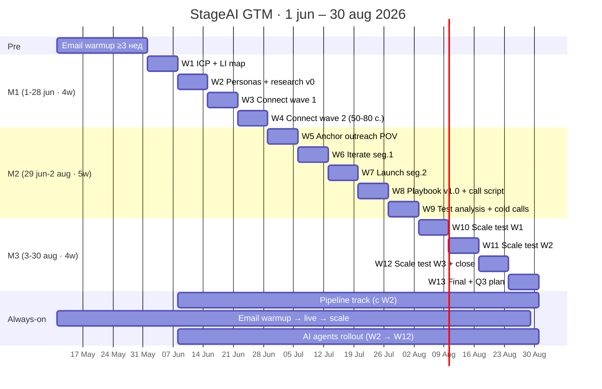

# TheStage AI · GTM Roadmap

**Voitech × Digital Hunch · 1 июн – 30 авг 2026 · 13 weeks**

PMF есть. Узкое место — **execution**: повторяемый outbound с **единым контекстом аккаунта**.
Операционка по неделям: [StageAI Roadmap](StageAI%20Roadmap.md).

---

## 📊 Goals per month — big picture

```
                M1                    M2                    M3
            1–28 июня          29 июн – 2 авг          3 – 30 авг
             4 weeks                5 weeks               4 weeks
─────────────────────────────────────────────────────────────────────
          Foundation           Targeted POV           Scale Test
          + Connect Test        2 segments            + Cold Calls


                20                    8                    15
          anchor accounts        meetings booked       meetings booked


                26                    2                    8
          connects @ 40%         active deals (SQO)    active deals total
                                 (this month)          (cumulative)


                 —                  €80k                €320k
              no pitch              pipeline           pipeline
                                  (2 × $40k ARR)      (8 × $40k ARR)
```

**Cumulative за 3 месяца: 23 meetings · 8 SQO · €320k pipeline @ avg $40k ARR · SQO conversion ~30%**

---

## 🗓️ Timeline — 13 weeks



---

## 🎯 Vision

**North star:** один живой контекст на каждый target-аккаунт.
Обновляется после **каждого** касания и **каждого** разговора.

**5 пилларов:**

🔍 **Deep account research** — IR / product / tech / signals · где AI (☁️ / 📱 / 🕶️)
💡 **Strategic POV** — per account · finance-row + ML-row
👥 **3 buyer personas** — ML / platform · Product / voice · Business exec
📡 **Multichannel sequences** — LinkedIn → Email → Cold calls (с W9)
📦 **Single context store** — hypothesis · touches · replies · POV · обновление ≤24h

**Принцип:** глубокий sequence на 20 anchor-аккаунтах, не «спрей». Founder-led на Tier 1.

---

## 🗣️ Три нарратива — три аудитории

Один продукт · три разных словаря.

### ML / VP Engineering

> «Срежем export hell — tiers S/M/L/XL под ваши SLO. Вместо месяцев ручной PTQ — недели до v1.»

Lead-метрики: **ttft · tps · max_memory_mb · weeks to v1**

### Product / Growth

> «Пользователь не слышит тишину после фразы. Local STT убирает cloud RTT. Работает офлайн.»

Lead-метрики: **p95 latency · offline survival · time-to-market**

### CFO / CEO / BD

> «AI в каждом RFP должен иметь $/1k sessions. Иначе это demo, а не SKU. Мы сокращаем эту строчку.»

Lead-метрики: **$/device/year · variable COGS (inference) · OEM design-win rate**

---

## 🎯 Три сегмента — где срочность реальна

Срочность возникает, когда **несколько сигналов совпадают одновременно**.

### Сегмент 1 · Voice + iOS + high MAU

**Combo-signals:** iOS app · 500k+ MAU · cloud inference в COGS · оптимизация расходов в ML job-specs
**Why now:** inference растёт быстрее revenue · CFO уже видит проблему · ML пробовали другое — не вышло
**Примеры:** Praktika-like tutors · language apps · voice companions

### Сегмент 2 · Glasses + iOS hub

**Combo-signals:** hardware startup · Bluetooth companion iOS · privacy = маркетинг
**Why now:** конкуренты уже пишут «on-device» в пресс-релизах · нужен реальный бенчмарк
**Примеры:** Halliday · Even Realities · Mentra

### Сегмент 3 · Public OEM под давлением инвесторов

**Combo-signals:** публичная компания · 10-K disclosures · инвестпрезентации · CES claims
**Why now:** следующий earnings call · аналитики спросят «сколько AI стоит на устройство»
**Примеры:** Vuzix · RealWear · DigiLens

---

## ⚙️ Два Motion

### Motion 1 · Public OEM (W3, finance-first)

Публичные компании с устройствами и AI. Под давлением инвесторов. Часто тратят на AI больше чем зарабатывают.

**Заход:** finance report → earnings call → CES claims → конкретный разрыв («AI в каждом устройстве» без $/device)
**Канал:** founder-led LinkedIn · cold calls на CFO/CEO/BD
**Сделка:** крупнее · цикл длиннее · prestige logo для Series A narrative

### Motion 2 · Series A–B voice / glasses startups (W1)

AI tutors · companions · voice assistants · glasses с iOS-приложением.

**Заход:** product/tech proof · MAU pressure · ML-led
**Канал:** LinkedIn ML + product personas · email sequences
**Сделка:** быстрее · revenue momentum

---

## 📐 Sales Enablement — что у фаундера в руках

**Визуалы** (Mermaid → PNG для slides, LinkedIn, email):

- ✅ Classic vs TheStage ML workflow *(есть)*
- ✅ Voice assistant flow — pain vs gain *(есть)*
- 🆕 Where-AI-runs decision tree (☁️ cloud · 📱 phone · 🕶️ on-chip)
- 🆕 **4 product layers** на одном слайде (Optimize · On-device · Orchestration · SDK)
- 🆕 **$/1k sessions before/after** — Vuzix-style chart для CFO
- 🆕 Segments × personas матрица
- 🆕 Account context = single source of truth (схема data flow)

**Battle cards** (1-pager каждая · для уверенных звонков):

- **Product card** — 4 layers с углом per persona
- **3 persona cards** — ML · Product · CFO (нарратив + lead-метрики + objection handlers)
- **Objections** — 8–10 типичных («у нас OpenAI», «Snapdragon уже умеет», «дорого», «accuracy drift»)
- **Competitors** — Mirai · Cactus · LiveKit · Apple/Google native · in-house build
- **Architecture honesty** — что делаем / **чего не делаем** (особенно on-glass Snapdragon)
- **Discovery script** — 4 finance-first вопроса (S7 / OEM motion)
- **Glossary 1-pager** — для нетехнических (10-K · OEM · $/1k sessions · COGS · MUD)

**Когда:** визуалы baseline → **W2** · battle cards draft → **W3–4** · полный pack live → **W5** (до anchor outreach).

---

## 🤖 AI / Automation layer

Single context per account = основа всей автоматизации.

### 1️⃣ Research Pipeline (n8n) — TAM build

```
sources → enrich → classify → segment → deep research → signals → POV draft
Prospeo · Wiza · Tavily · WhyzerAI (public co.) · web   →   tags/tiers   →   POV stub
```

Цель: построить и обогатить TAM по сегментам W1/W2/W3.
**Когда:** W2 v0 (Prospeo→tag→CSV) · **W4 v1** (полный flow) · W7 v1.5 (signals)

### 2️⃣ Call analysis → Slack

Триггер: запись звонка (Gong/Fathom/Otter).
Pipeline: transcript → key insights → **обновление контекста аккаунта** → предложения по корректировке strategy / sequence / POV.
**Когда:** W5 (после первых targeted звонков).

### 3️⃣ Daily / Weekly Slack reports

- **Daily:** connects · replies · meetings · sequence health
- **Weekly:** cohort performance · sequence iteration hints · pipeline movement

**Когда:** W3 basic · **W6 full**.

### 4️⃣ Hermes — scheduled agent

Регулярный скан целевых аккаунтов: **news · 10-K / earnings · hires · product launches · social signals**.
Output: Slack ping + auto-enrich контекста.
**Когда:** W7–8.

### 5️⃣ Business case calculators

Для late-funnel переговоров: **$/1k sessions · $/device/year · payback · VUZI-style layered unit economics**.
Под конкретный deal · технический и бизнес-readout.
**Когда:** W10–12 (под active SQOs).

---

## 📅 План — 3 месяца (детально)

### Month 1 · Foundation + Connect Test
**1–28 июня · 4 weeks**

```
Pre  (май)       Email infra: домены + 4–6 inbox + warmup ≥3 нед
W1   1–7 июн     ICP v0.1 · LI account map · KPI 90d · pipeline access
W2   8–14 июн    ICP v0.2 + 3 personas · research pipeline v0 · визуалы baseline
W3   15–21 июн   Connect wave 1: 20 co · battle cards draft · daily Slack basic
W4   22–28 июн   Connect wave 2: → 50–80 contacts · research pipeline v1
```

**Итог месяца:**
- 20 anchor accounts · 3 personas v1 · **~26 connects @ 40%**
- 4 новых визуала · battle cards draft · daily Slack · research pipeline v1
- **Meetings: 0** (no pitch) · **Pipeline: €0**

---

### Month 2 · Targeted Outreach (POV-led)
**29 июня – 2 августа · 5 weeks**

```
W5   29 июн – 5 июл   Anchor 20 outreach: POV + sequences · battle cards pack live
W6   6–12 июл         Iterate seg.1 · call analysis agent · weekly Slack full
W7   13–19 июл        Launch seg.2 · research pipeline v1.5 (signals)
W8   20–26 июл        Playbook v1.0 · Hermes live · call script v1
W9   27 июл – 2 авг   Test analysis (4 weeks) · cold calls start (execs)
```

**Итог месяца:**
- 20 POV packs · 2 сегмента в работе · playbook v1.0
- Полный battle cards pack · call analysis · Hermes scheduled
- **Meetings: 8 · SQO: 2 · Pipeline: €80k** (2 × $40k ARR)

---

### Month 3 · Scale Test + Cold Calls + Close
**3 – 30 августа · 4 weeks**

```
W10  3–9 авг          Scale: 20-25 co/нед · cold calls в полную силу · BC calc v1
W11  10–16 авг        Continued scale · mid-test decision memo
W12  17–23 авг        Continued scale · business case per active deal · close support
W13  24–30 авг        Final scale week · final report · scale/kill matrix · Q3 plan
```

**Итог месяца:**
- 80–100 companies · 400–500 contacts · 4-week scale test complete
- Business case calculators per deal · automation roadmap Q3
- **Meetings: 15 · SQO: +6 (8 total) · Pipeline: €320k** (8 × $40k ARR)

---

## 📊 Funnel @ 40 / 30 / 30

```
W3–4    Connect test       65 contacts   → 26 connects (40%)         ─ M1
W5–9    Targeted (seg.1+2) ~80 messaged  → 24 replies → 8 meetings   ─ M2
W10–13  Scale test         400 contacts  → 160 connects → 48 replies
                                        → 15 meetings → 6 new SQO    ─ M3

3-month cumulative: 23 meetings · 8 SQO · €320k pipeline @ $40k ARR
```

**Сценарии (для capacity planning M3):**

- Conservative (30 / 20 / 20): **120 connects · 24 replies · 5 meetings**
- **Target (40 / 30 / 30): 160 · 48 · 15 ← план**
- Stretch (50 / 35 / 35): **200 · 70 · 24**

---

## 🔗 LinkedIn — 3 аккаунта

**Paul · Кирилл · co-founder**

- **Tone:** единый science-founder voice · **не «generic SDR»**
- **Founder-led** только на Tier 1 / W3 (public OEM)
- **Ёмкость:** 1 000–1 500 контактов / мес
- **Daily cap:** ~90–120 connects/день на 3 аккаунта (max)
- **Пилот W3–4:** 5–8 req/день/акк
- **Тест W10–13:** 20–25 req/день/акк

---

## 📧 Email — расчёт inboxes

**Vars:** 25 sends/inbox/day · 4 emails/lead за 3 weeks

```
M2 пилот (W5–9)     60–100 leads          2–3 inbox     peak 40–60/day
M3 тест (W10–13)    400 leads              4–5 inbox     peak 90–110/day
Q3 scale (LI parity)   1 000–1 500/мес      8–10 inbox    peak 200–250/day
```

**Закупка по фазам:**

- **Pre-project (май):** 4–6 inbox warmup · 2–3 домена
- **M2 go-live:** 4–6 prod inboxes
- **M3 test:** 4–5 active
- **Q3 scale:** 10 inbox (Zapmail pack) · 3–5 доменов

---

## 💰 Tools & бюджет (EUR / мес)

```
GetSales × 3 seats         €255      LI + email sequences, enrichment
Zapmail (10 mailboxes)      €39      Inboxes
Prospeo                     €49      Company / contact DB
Wiza                        €49      Contact API
WhyzerAI                    €30      Deep account research (10-K · IR · earnings)
                                      для publicly traded — Motion 1 / W3
Tavily                   €30–50      Web research
OpenRouter               €20–40      LLM API (n8n + scripts)
Railway                  €20–40      Hosting n8n / workers
Supabase                  €0–20      CRM-adjacent data
n8n (self-hosted) / Git       €0     Workflows / repo

Cursor + Claude        per usage
Domains + DNS            заказчик    Email reputation
Voitech analytics          custom    TOFU/BOFU · CRM pull
```

**Total: ~€490–580 / мес** (без Cursor/Claude) + домены у заказчика.

*Без Clay на старте — Prospeo + Wiza + WhyzerAI + n8n покрывают research pipeline.*

---

## 🔁 Marketing sync (Digital Hunch)

- **M1:** foundation · pillars · ICP/personas align
- **M2:** founder posts 2/нед · long-form под winning pain · POV hooks в copy
- **M3:** case study · newsletter · cohort hooks

**ABM / paid ads: ❌ первые 2 месяца** — после валидации сегментов.

**Optional:** добрать GTM-инженера для ускорения research/automation.

---

## ✅ Что нужно от фаундера

- **Pre-W1 (май):** оплата доменов · inbox setup · warmup ≥3 нед
- **W1 (1–7 июн):** owner GTM · какие LI-аккаунты + лимиты · KPI 90d
- **W2 (8–14 июн):** approval 3 personas · реальные чеки 6 clients
- **W5 (29 июн):** sign-off на POV + sequences (20 anchor)
- **W9 (27 июл):** exec narrative для cold calls · календарь meetings
- **W10–12:** участие в late-funnel calls по active SQO (champion meetings)

---

## 📥 Входные данные (на старте)

- Подробные истории сделок / юз-кейсы текущих заказчиков
- Технические ограничения продукта
- Записи демо · доступ в CRM
- Inbound запросы (история)
- Сегменты и списки (если есть)
- Roadmap продукта 3–6 мес

---

## ❓ Стартовые вопросы

- **Фандрейзинг:** какой трекшн нужен и в каком сегменте перед раундом
- **Кирилл:** доступность (часов/нед) · формат вовлечения
- **Формат взаимодействия Voitech ↔ DH:** регулярность · отчётность · counterpart
- **Scope:** продажи · маркетинг · контент · PR
- **Owner GTM** внутри TheStage — кто и насколько вовлечён
- **Success 90 дней — в цифрах**

---

## 🗂️ Документы

- **Этот файл** — фаундер: стратегия + 3 мес + цифры
- [StageAI Roadmap](StageAI%20Roadmap.md) — команда: операционка W0–W13
- [Outbound proposal Sprites](Outbound%20GTM%20Execution%20Proposal%20for%20Sprites.md) — референс структуры
- [GTM Framework PDF](TheStageAI_GTM_Framework.pdf) — DH маркетинг
- [Understanding brief](Stage%20AI%20%E2%80%94%20understanding%20brief.md) — продукт · ICP

---

*v.4 · founder-ready · 1 июн – 30 авг 2026 · 13-week · big-numbers + Gantt*
