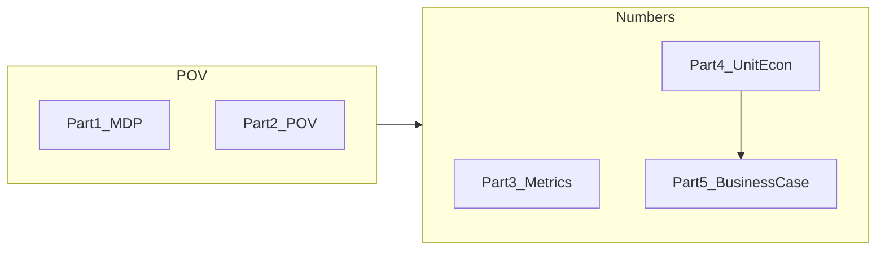

# Vuzix (VUZI) — POV and business case (illustration)

## Глоссарий

| Термин | Простыми словами |
|--------|------------------|
| **POV** | Не контракт, а **согласованная история**: почему сейчас, что болит, что изменится — чтобы CEO/CFO сказали «да, это наша проблема». |
| **Business case** | **Цифры сделки:** сколько вложим, сколько сэкономим, за какой срок окупится — после того как POV принят. |
| **PoC / Phase 0** | Короткий **платный тест** (≈6 недель): измеряем на одной реальной модели клиента «было / стало». |
| **CES** | Крупная выставка электроники (январь), где компании показывают **демо новых продуктов** инвесторам и прессе. |
| **IR** | **Отношения с инвесторами:** отчёты, звонки с аналитиками, презентации для биржи — всё, что читает рынок. |
| **10-K** | Годовой отчёт **публичной** компании в США (финансы, риски, стратегия). |
| **OEM** | **Производитель «под чужим брендом»:** Vuzix отдаёт **референс-дизайн** (готовый шаблон очков), другая фирма вшивает его в свой продукт и продаёт под своим именем. |
| **Reference design / ref design** | Готовый **шаблон продукта** для партнёров: «вот такие очки можно лицензировать и выпускать». |
| **SKU** | Конкретная **модель / версия** продукта в линейке (как разные iPhone). |
| **Pilot (пилот)** | **Пробный проект** с партнёром до полного контракта — часто съедает облачный бюджет без гарантии выручки. |
| **RFP** | **Запрос предложений:** партнёр просит цены, сроки и **измеримые** характеристики AI — без цифр проигрывают. |
| **SLO** | **Обещание по качеству сервиса** в цифрах (например: «голос отвечает за 300 мс в 95% случаев») — то, что можно положить в контракт. |
| **p95 latency** | «В **95%** случаев ответ не медленнее X мс» — понятная OEM-метрика вместо жаргона ML. |
| **Inference** | **Запуск AI-модели** (распознать голос, ответить, распознать картинку) — каждый запуск стоит GPU-времени. |
| **Session (сессия)** | Один **пользовательский цикл** AI: сказал команду → получил ответ, или один пакет «фото + ответ». |
| **Cloud / GPU** | AI крутится **на серверах в облаке**, не в очках; за это платят **помесячно** (variable cost). |
| **COGS** | **Себестоимость** того, что вы **уже продаёте** — здесь: облако на каждое устройство/сессию, не зарплаты офиса. |
| **OpEx** | **Операционные расходы** компании: зарплаты, офис, программы сокращения — **TheStage это не обещает** резать. |
| **Going concern** | Формулировка в отчёте: «есть **сомнение**, выдержит ли компания год без новых денег» — давление на CEO/CFO. |
| **Snapdragon / AR1** | Чип **внутри дужки очков** — там уже встроен голос/перевод **без** TheStage. |
| **On-glass / on-device** | AI **в самих очках или телефоне**, без облака TheStage в Phase 1. |
| **NVIDIA cloud** | Серверы с видеокартами NVIDIA — там обычно крутят тяжёлые модели; **TheStage оптимизирует этот слой**. |
| **TheStage Layer A** | Продукт **«сделать облачный AI дешевле и быстрее»** (Elastic + ANNA), без замены железа в очках. |
| **$/1k sessions** | «Сколько стоит **тысяча** пользовательских AI-циклов» — удобно для CFO и OEM. |
| **$/device/year** | «Сколько **одно устройство в год** экономит на облаке» после оптимизации — наша главная **простая** метрика для exec. |
| **MUD** | Три слова для CFO: обещание **значимое**, **уникальное**, **проверяемое** (после PoC). |
| **Champion** | Человек **внутри Vuzix**, который ведёт слайды на встрече с CEO/CFO — не мы в одиночку. |

**Одна фраза про Vuzix:** продаём не «прошивку очков», а **измеримую экономику облачного AI** для OEM-партнёров и пилотов — пока голос на чипе в дужке остаётся как есть.

**GTM-стратегия этого motion (landmarks, сигналы, чеклисты):** GTM — finance-first motion (strategy & prep)).

---

## Как читать этот документ

| Часть | Что это | Для кого |
|-------|---------|----------|
| **0** | Факты + архитектура | Research (Stage 1) |
| **1** | Mega Deal Premise (MDP) | CEO / strategy |
| **2** | Strategic POV | Consensus (Stage 2) |
| **3** | Metrics registry | Narrative / messaging |
| **4** | Unit economics (layers) | CFO + ML |
| **5** | Business case (ROI) | CFO + procurement |
| **6** | Sales flow checklist | AE / founder |
| **Appendix** | Assumptions, glossary | Single source of truth |

**Разделение (ESC):** **POV** готовит согласие и story; **business case** — investment, ROI, cost of inaction **после** buy-in; **PoC** = proof of impact (PoI).



---

## Part 0 — Vuzix snapshot (public + architecture)

### 0.1 Company facts (illustration inputs)

| Signal | Illustration value | Простыми словами | Source / use |
|--------|-------------------|------------------|--------------|
| **Revenue** | ~**$6.3M** (FY2025) | Маленькая выручка → разговор про **экономию на облаке**, не «спасём весь бюджет» | IR |
| **Net loss** | ~**$32M** (FY2025) | Компания **сильно убыточна** — не обещаем срез зарплат | 10-K |
| **Headcount** | ~**100–150** FTE | Порядок размера команды | — |
| **Strategy** | OEM reference designs, partnerships (Quanta, Garmin) | Деньги в **лицензиях дизайна** партнёрам, не только в своих очках | Calls / IR |
| **AI positioning** | Ultralite: voice on **AR1** chip (CES story) | На выставке показывают **AI в очках** — инвесторы ждут цифр | CES / press |
| **Going concern / OpEx** | ~$8M cost cuts (programs) | Давление **сжать расходы** — мы **не** заявляем, что режем эти $8M | 10-K — **not** our claim |

### 0.2 Architecture map — where TheStage applies

| Product / path | Where AI runs | Простыми словами | TheStage today | $ in model |
|----------------|---------------|------------------|----------------|------------|
| **M400** industrial | На очках (локально) | Голос **без облака** — свой SDK Vuzix | ❌ | **$0** |
| **Ultralite / LX1** | В чипе в дужке (AR1) | Голос/перевод **уже в железе** партнёра Qualcomm | ❌ | **$0** |
| **Partner AI** (Ramblr-class) | **Облако** | «Умный контекст» через сервер — **здесь платят GPU** | ✅ Layer A | **Основной** |
| **OEM demos / R&D** | **Облако** NVIDIA | Пресейл и тесты для партнёров | ✅ | Вторичный |
| **Companion iPhone** | Телефон | Если в продукте есть **хаб-телефон** | ⚠️ позже | Опционально |
| **Defense / edge** | Jetson (коробка) | Ниша обороны | ⚠️ позже | Опционально |

**Сегмент S7 → W3:** очки с AI на чипе, но **наша ценность сейчас — облако и OEM-пилоты**, не замена чипа в дужке.

---

## Part 1 — Mega Deal Premise (MDP)

*Ref:* MDS Session 4 — Mega Deal Premise

### 1.1 Three components

| Component | Vuzix illustration |
|-----------|-------------------|
| **Unique insight** | Everyone sees «AI glasses» in CES decks — but **if you look deeper**, Vuzix and OEM partners are scaling **cloud-backed AI** (voice, vision, contextual assistants) **without a published unit-economic spec**. Each new reference design risks **linear growth in inference COGS**, not gross margin. |
| **Core imperative** | Make **OEM + software ecosystem** partnerships **monetizable and defensible** while **reducing cash burn** — AI must show up in **RFPs and earnings** as **measurable** (latency, $/session), not demo-only. |
| **Distinctive value (TheStage)** | Only path that **optimizes your existing NVIDIA cloud inference** and delivers **measurable unit economics** ($/1k sessions, $/device/year, p95) **without** asking you to rip out Qualcomm on-glass or rebuild embedded Speech SDK. |

### 1.2 UVP talk track (5 steps)

| Step | Script (short) |
|------|----------------|
| **1. Crowd** | «Every smart-glasses OEM is adding voice and vision AI — investors expect it on the slide.» |
| **2. Unique insight** | «The hidden bottleneck isn't the lens — it's **inference unit economics** on the cloud path you already depend on for partners and OEM pilots.» |
| **3. Pain** | «Each Ultralite-class program adds **GPU COGS**; pilots don't convert to licensed SKUs because **CFO can't underwrite** AI without $/device.» |
| **4. End state** | «Every reference design ships with a **one-page AI spec**: p95 latency + **$/1k inference sessions** — same rigor as FOV and battery.» |
| **5. Path** | «6-week benchmark on **one** production model → production optimize → OEM pack. We don't touch AR1 firmware in Phase 1.» |

### 1.3 Capability ↔ imperative map

```
Core imperative: OEM ecosystem + AI monetization without burning cash
        │
        ├──► TheStage: ANNA + Elastic on NVIDIA cloud
        │         └──► measurable $/session, fewer GPU-hrs
        │
        └──► TheStage: OEM benchmark pack
                  └──► design-win narrative for Quanta/Garmin-class partners
```

---

## Part 2 — Strategic POV

*Ref:* Strategic POV Development · Financial Literacy — O→I→I

### 2.1 Observation → Implication → Insight

| Step | Vuzix illustration | Простыми словами |
|------|-------------------|------------------|
| **Observation** | ~$6M revenue, **$32M loss**; pivot to **OEM**; CES AI on Ultralite; partner **cloud AI**; **no** $/device in IR | Мало продают, много теряют; AI в прессе есть, **цифр для инвесторов нет** |
| **Implication** | Cloud pilots **subsidized**; OEM stalls on $/device; duplicate ML per SKU | Пилоты **съедают деньги**; партнёры спрашивают цену — ответа нет |
| **Insight** | Optimize **NVIDIA cloud** first → AI becomes **P&L-ready** | Сначала **измерить и удешевить облако** — потом масштабировать OEM |

### 2.2 Strategic Soundbite (CEO)

> Because **every OEM now expects voice and vision AI in smart-glasses reference designs**, now is the time for Vuzix to **publish unit-economic AI specs** (latency + **$/1k inference sessions**) on the **cloud and partner paths you already use**. When you do, **OEM pilots convert to licensed designs** and partnerships survive diligence. If you do not, **each new SKU adds hidden GPU COGS** and AI stays a **demo**, not an **investor-grade** story.

### 2.3 MUD statement (CFO)

> We will **reduce loaded cloud inference cost by ~35% (PoC-validated range 25–50%)** on Vuzix's highest-volume **cloud AI workload** through **TheStage Elastic + ANNA on NVIDIA**, by **benchmarking one production model in Phase 0**, resulting in approximately **$5 variable savings per in-scope device per year** (illustration: **12,000 devices → ~$60k/year** recurring) as supported by **measured $/session before/after** and optional **SaladCloud-class efficiency proof**.

**MUD check:** Meaningful (variable COGS) · Unique (inference optimize, not GPU rental) · Defensible (PoC — **not** pre-PoC contract claim).

### 2.4 Today → Tomorrow (by audience)

| Role | Today | Tomorrow (with TheStage) |
|------|-------|----------------------------|
| **CEO** | AI in press; **no** measurable P&L metric | **One metric** on ref design / partnership ($/1k sessions) |
| **CFO** | Cloud AI cost **opaque** per SKU | **$/device/year** model; pilot COGS forecastable |
| **VP BD / OEM** | AI claims **without** unit economics | **Business case:** p95 + $/1k sessions |
| **VP Eng / ML** | Manual quant / duplicate stacks | **Tiers S/M/L**; 2–3 week deploy cycle on cloud model |
| **Partner (Ramblr-class)** | Shared cloud bill | Lower **$/inference** on joint pipeline |

### 2.5 POV is not the business case

| POV delivers | Business case delivers (Part 5) |
|--------------|----------------------------------|
| Strategic alignment | **Investment** $ and timeline |
| Hypothesis $/device | **Agreed** success metrics post-PoC |
| Champion ownership | ROI, payback, cost of inaction |

---

## Part 3 — Metrics registry (StageAI narrative)

*Какими метриками ведём разговор — primary (exec/finance) vs enabling (ML).*

### 3.1 Primary — dollars and unit economics (CFO / IR)

| Metric | Definition | Простыми словами | How TheStage moves it |
|--------|------------|------------------|----------------------|
| **$/inference** | Cost per one AI run | Цена **одного** запуска модели | Fewer GPU-seconds (ANNA) |
| **$/1k sessions** | Cost per 1000 user AI cycles | «Тысяча голосовых циклов стоит $X» | Roll-up for OEM decks |
| **$/device/year** | Annual cloud save per device | **Главная простая цифра** для CFO | «12k устройств × $5 = $60k/год» |
| **GPU-hours per $** | How much output per $ GPU | «Тот же сервис, меньше серверов» | PoC proves band |
| **OEM pilot subsidy** | Cloud $ burned per trial | Деньги на **пилоты до контракта** | Cheaper sessions → less burn |
| **Cost of inaction** | 3-year «if we do nothing» | «Сколько потеряем, если не оптимизируем» | Part 5 model |

### 3.2 Primary — strategic (CEO / BD)

| Metric | How TheStage enables | Notes |
|--------|---------------------|-------|
| **OEM design-win rate** (proxy) | Business case with measurable AI economics | Qualitative unless Vuzix shares win/loss |
| **Time-to-SKU (AI block)** | Weeks → days on cloud model deploy | ~1.5 FTE-months × 2 SKUs illustration |
| **AI services / licensing attach** | Enables **pricing** AI, not automatic revenue | Do not book as TheStage revenue |
| **Partnership credibility** | Diligence-ready benchmark pack | Quanta/Garmin-class narratives |

### 3.3 Enabling — technical proof (ML; not lead in first 10 min with CFO)

| Metric | Role in deal |
|--------|--------------|
| **p95 latency** (ms) | Unlocks UX + OEM claims |
| **ttft / tps** | LLM/STT PoI |
| **Tier S / M / L / XL** | Deployment choice |
| **max_memory_mb** | Relevant if companion iOS path |

### 3.4 Do not claim (anti-metrics)

- Gross margin **%** improvement (unless Vuzix allocates AI to COGS and provides baseline)  
- **Headcount / OpEx** reduction ($8M program)  
- **Snapdragon on-glass** compile or Speech SDK replacement  
- **$500k/year** without defining **N** and attach rate  
- **2–4×** without PoC on **their** model  

---

## Part 4 — Unit economics model (illustration)

### 4.1 Three definitions of «device» (avoid false 100k × $5)

| Label | Definition | Illustration N (Year 2 steady state) |
|-------|------------|--------------------------------------|
| **A — In-scope** | Units with **active cloud AI path** (enterprise deployment + partner stack consuming GPU) | **12,000** |
| **B — OEM footprint** | Units under **OEM reference-design** licenses (partial overlap with A) | **+8,000** (not additive blindly) |
| **C — Hardware shipped** | Total units shipped (all SKUs) | **~22,000** (order of magnitude: $6.3M ÷ ~$285 blended ASP) |

**Rule:** Only multiply **$/device/year** by **A** (or clearly defined B) — **not** by C unless every shipped unit runs cloud AI.

### 4.2 Layer 1 — Session economics (foundation)

| Input | Value | Notes |
|-------|-------|-------|
| Cloud AI **sessions** / device / year | **150** | Mix: voice commands + periodic vision/LLM batches (enterprise) |
| Loaded GPU **cost / session** (before optimize) | **$0.10** | Illustrative; self-hosted NVIDIA mid — **replace in PoC** |
| TheStage optimization (conservative) | **35%** | PoC target band **25–50%**; below 2–4× marketing |
| **Savings / session** | $0.10 × 35% = **$0.035** | |
| **Savings / device / year** | 150 × $0.035 = **$5.25** | Rounds to **$5** in narrative |

**Formula (single source of truth):**

```
$/device/year = sessions_per_device_yr × cost_per_session × optimization_rate
Annual savings = $/device/year × N_in_scope
```

### 4.3 Layer 2 — Scenario table (N × $/device/year)

| Scenario | N (in-scope units) | $/device/yr | **Annual variable savings** | When to use |
|----------|-------------------|-------------|----------------------------|-------------|
| **Conservative** | 8,000 | $4 | **$32,000** | Low attach to cloud AI |
| **Base** | 12,000 | $5 | **$60,000** | **Default illustration** |
| **Growth** | 25,000 | $5 | **$125,000** | OEM pipeline converts |
| **Stretch footprint** | 50,000 | $5 | **$250,000** | Multi-year OEM license cumulative |
| **Narrative stretch** | 100,000 | $5 | **$500,000** | **Only** if N = cumulative cloud-enabled OEM footprint over **several years**, **not** single-year units shipped |

**Footnote for 100,000 × $5 = $500,000:** Valid as **strategic TAM-style** narrative for CEO («if our OEM ecosystem reaches 100k cloud-enabled units, variable savings scale to half a million») — **invalid** as «we shipped 100k glasses last year.»

### 4.4 Layer 3 — OEM pilot subsidy (cloud burn)

| Input | Value |
|-------|-------|
| Active OEM / partner **pilots** / year | 10 |
| Avg **cloud GPU spend** per pilot / year | $18,000 |
| Optimization rate | 35% |
| **Annual savings** | 10 × $18,000 × 35% ≈ **$63,000** |

*Partially overlaps Layer 2 if pilots convert to in-scope devices — do not double-count in «total» without adjustment.*

### 4.5 Layer 4 — R&D efficiency (soft)

| Input | Value |
|-------|-------|
| FTE-months saved per new AI SKU (quant + deploy) | 1.5 |
| New SKUs / year using cloud optimize path | 2 |
| Fully loaded cost / FTE-month (equiv.) | $12,000 |
| **Annual value** | 1.5 × 2 × $12,000 = **$36,000** |

Book as **productivity**, not cash COGS — CFO may discount.

### 4.6 Layer 5 — Internal R&D GPU (minor)

| Input | Value |
|-------|-------|
| GPU-hours saved on benchmarks / year | 500 |
| $ / GPU-hour | $3 |
| **Annual savings** | **~$1,500** |

### 4.7 Optional paths (separate tables — Phase 2+)

| Path | N | $/unit/yr (illustration) | Annual | TheStage |
|------|---|-------------------------|--------|----------|
| **Companion iOS** (if SKU uses iPhone hub) | 5,000 | $2 | $10,000 | S4 Apple compile |
| **Jetson defense edge** | 500 boxes | $40 | $20,000 | S5 edge export |

**Not included in on-glass AR1 or M400 local speech today.**

### 4.8 Roll-up — Year 2 base (illustration)

| Layer | Annual $ | Double-count risk |
|-------|----------|-------------------|
| L2 Base (12k × $5) | **$60,000** | — |
| L3 OEM pilots | **$63,000** | Adjust if pilots ⊂ L2 |
| L4 R&D efficiency | **$36,000** | Soft |
| L5 Internal GPU | **$1,500** | Minor |
| **Illustrative total (adjusted)** | **~$120k–$159k** | Mid: **~$140k/yr** |

**Not $500k** unless **Narrative stretch** scope (50k–100k in-scope units) is explicitly accepted by customer.

### 4.9 Year 1–3 trajectory (illustration)

| Year | N in-scope | $/device | L2 savings | Cumulative note |
|------|------------|----------|------------|-----------------|
| **Y1** (PoC + partial prod) | 6,000 | $4 | $24,000 | PoC proves rate |
| **Y2** | 12,000 | $5 | $60,000 | Base steady |
| **Y3** | 25,000 | $5 | $125,000 | Growth scenario |

---

## Part 5 — Business case

### 5.1 Investment (illustration)

| Item | Low | High | Notes |
|------|-----|------|-------|
| **Phase 0 PoC** (6 weeks, 1 model, benchmark) | $35,000 | $45,000 | Whisper-class or partner vision encoder |
| **Year 1 production** (optimize 1–2 models, platform) | $70,000 | $90,000 | ~2 GPU-equiv + ANNA; not full OpEx |
| **Year 2 run-rate** | $60,000 | $80,000 | Maintenance + 2nd model optional |
| **3-year investment (illustration)** | **~$200k** | **~$250k** | |

### 5.2 Returns (illustration, variable + soft)

| Year | L2 | L3 | L4 | **Total benefit** |
|------|----|----|-----|-------------------|
| Y1 | $24k | $40k | $20k | **~$84k** |
| Y2 | $60k | $63k | $36k | **~$140k** (adjusted) |
| Y3 | $125k | $70k | $36k | **~$231k** |

**3-year illustrative benefit (base/growth blend):** **~$350k–$450k** variable + productivity.

### 5.3 Payback (base)

| Metric | Illustration |
|--------|--------------|
| Cumulative investment (3 yr) | ~$225k |
| Cumulative benefit (3 yr) | ~$400k |
| **Simple payback** | **~18–24 months** from start of Phase 1 (on variable L2 only, faster if L3 included) |

*Sensitivity required before contract — this is model-only.*

### 5.4 Cost of inaction (3-year counterfactual)

| Risk | Illustration impact |
|------|---------------------|
| **Cloud COGS** grows with each AI SKU, no optimize | +$15k → +$45k/yr extra vs optimized path (N growth 6k→12k) |
| **2–3 OEM programs stall** on «prove AI unit economics» | Strategic; 1 win ≈ $500k–$2M+ lifetime value — **use only if Vuzix shares deal size** |
| **Duplicate ML** per SKU | +$36k/yr equivalent (L4 not captured) |
| **IR narrative** | AI stays non-metric; partnership discounts |

### 5.5 Opportunity cost

- Quanta/Garmin-class partners increasingly require **latency + cost** data in technical diligence.  
- Without benchmark pack, Vuzix subsidizes pilots from **operating loss** — unsustainable at **~$6M revenue** scale.

### 5.6 Sensitivity (PoC must narrow)

| Variable | Low | Base | High |
|----------|-----|------|------|
| Optimization % | 25% | 35% | 50% |
| Sessions / device / yr | 100 | 150 | 200 |
| N in-scope Y2 | 8,000 | 12,000 | 25,000 |
| **$/device/yr saved** | $2.50 | $5.25 | $10.00 |
| **Annual L2 savings** | $20k | $63k | $250k |

### 5.7 Phased path (product + $)

| Phase | Duration | Scope | Deliverable | $ impact |
|-------|----------|-------|-------------|----------|
| **0** | 6 weeks | 1 cloud model on **their** NVIDIA | $/session, p95, optimization % | PoI |
| **1** | 2–3 months | Production optimize primary workload | Recurring L2 | Variable $ |
| **2** | Q+ | OEM benchmark PDF + optional 2nd model | L3, BD | Strategic |

**TheStage layer:** **A only** in Phase 0–1 (Optimize). No Platform-as-lead. No on-glass SDK in Phase 1.

---

## Part 6 — End-to-end sales flow

*Ref:* POV framework §5.3.md#53-consensus-checklist)

### Stage 1 — Hypothesis (TheStage + research)

- [x] 10-K / earnings themes documented (Part 0)  
- [x] Architecture honesty: AR1 + Speech SDK = $0 TheStage today  
- [x] S7 → W3; cloud wedge identified  
- [ ] **Live:** confirm monthly cloud spend order of magnitude with VP Eng  

### Stage 2 — Consensus (champion + ML + CFO)

- [ ] **Champion** named (VP BD or VP Eng) — commits to **present** Stage 3  
- [ ] **ML** signs PoC scope: 1 model, success = $/session + p95  
- [ ] **CFO** agrees $5/device is **hypothesis** until Phase 0  
- [ ] V1→V3 POV deck co-edited; **you own** document  
- [ ] CRM: `buyer_motion: hybrid` (exec-led + eng-led)  

### Stage 3 — Executive (champion presents)

**Agenda (30 min):**

1. Strategic Soundbite (CEO) — 2 min  
2. MUD (CFO) — 2 min  
3. One slide: **12,000 × $5 = $60,000/yr** + footnotes (Part 4.3)  
4. Architecture honesty slide (30 sec)  
5. Phase 0 ask: $40k, 6 weeks  
6. ML deep-dive optional second meeting  

**Dual deliverables post-PoC:**

| Deliverable | Owner | Audience |
|-------------|-------|----------|
| Finance memo | TheStage + champion | CFO |
| Tech report | TheStage | VP Eng |

---

## Appendix A — Assumptions (single source of truth)

| ID | Assumption | Value | Must validate in PoC |
|----|------------|-------|----------------------|
| A1 | Sessions / device / year | 150 | Usage telemetry |
| A2 | $ / session before | $0.10 | Invoice + GPU metering |
| A3 | Optimization % | 35% | Benchmark |
| A4 | N in-scope Y2 | 12,000 | Attach rate to cloud AI |
| A5 | Pilots / year | 10 | BD pipeline |
| A6 | $ / pilot cloud / yr | $18,000 | Finance |
| A7 | TheStage fees | Part 5 table | Quote |

---

## Appendix B — Glossary (technical + plain)

| Term | Technical | Простыми словами |
|------|-----------|------------------|
| **Session** | One voice turn or vision+LLM job | Один **цикл** «пользователь спросил — AI ответил» |
| **In-scope unit** | Device-year with cloud AI | Устройство, за которое **реально платят облако** за AI |
| **Loaded cost** | GPU + cloud overhead per session | Полная **себестоимость** одного цикла, не «цена API из прайса» |
| **Optimization %** | $/session reduction after PoC | На сколько **% подешевел** один цикл после TheStage |
| **COGS** | Cost of goods sold | Переменные costs **на единицу продукции** (здесь — облако) |
| **PoI** | Proof of impact | **Доказательство эффекта** после PoC (цифры до/после) |
| **ttft / tps** | Time to first token / tokens per sec | Скорость **начала ответа** / потока текста — для ML, не для CEO |
| **Tier S/M/L** | Model size deployment buckets | **Размер** модели под железо — для инженеров |

---

## Appendix C — Do not say

1. «We will cut your **$8M OpEx**.»  
2. «**Every** Vuzix device saves $5.»  
3. «We replace **Snapdragon / AR1**.»  
4. «**$500k guaranteed** savings next year.»  
5. «**2–4×**» without PoC on their model.  
6. «Full **on-device orchestration** shipped today.»

---

## Appendix D — Related links

| Doc | Role |
|-----|------|
| MDS Mega Deal Premise | MDP methodology |
| Strategic POV Development | 3 stages, MUD, soundbite |
| Financial Literacy 101 | O→I→I, public co metrics |
